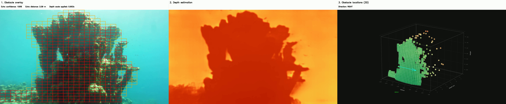
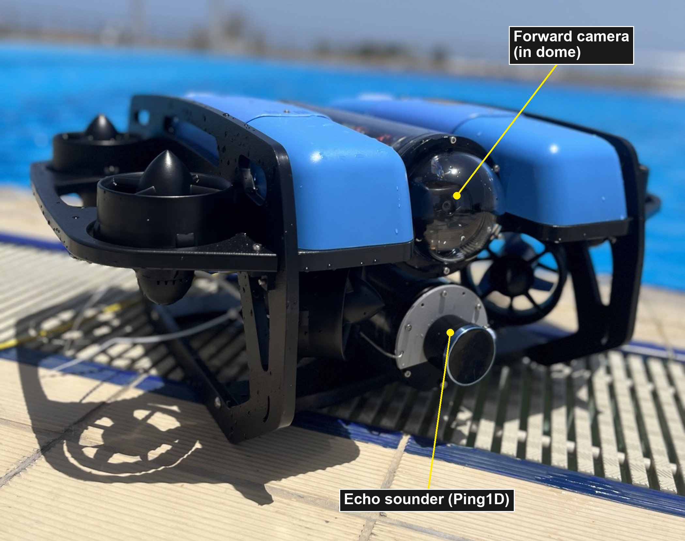
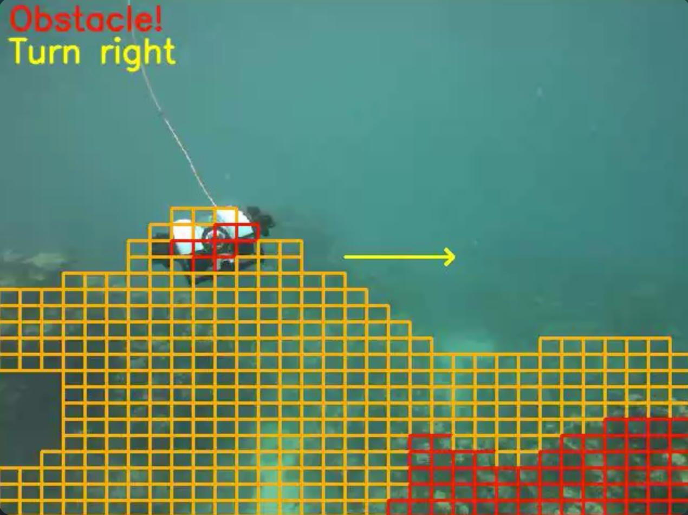
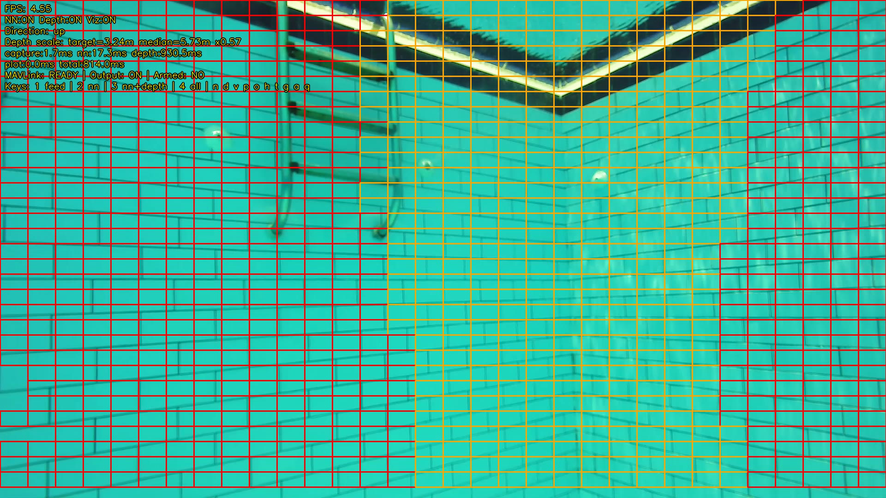
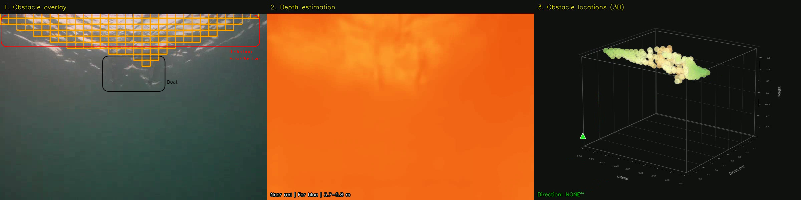

# Monocular Obstacle Detection for Underwater Experimental Platforms

<p align="center">
  <a href="#"></a>
  <a href="#code"></a>
  ">
  
</p>

**Real-time, low-cost obstacle detection and avoidance for small underwater vehicles — using a single camera and a $150 echosounder. No stereo rig, no multibeam sonar, no DVL.**

<p align="center">
  <video src="videos/opensea_rov_good_snippet.mp4" controls muted loop width="860"></video>
  <br>
  <em>Open-sea deployment on a BlueROV2. Left: detected obstacles overlaid on the camera feed. Middle: dense metric depth. Right: 3D obstacle locations and the avoidance direction.</em>
</p>

> Code will be posted soon, after paper acceptance.

---

## At a glance

| | |
|---|---|
| **Detector** | Lightweight CNN, 2D obstacle detection at **117–128 FPS** on a Jetson Orin Nano |
| **Depth** | Metric **Depth Anything V2 (ViT-S)**, 392×392 FP16, 220 ms/frame, asynchronous with the detector |
| **Scale anchoring** | Single forward echosounder projected into the image — **−9.6% RMSE** on held-out FLSea locations |
| **Output** | High-level navigation setpoints, steering toward the direction of greatest available depth |
| **Cost** | Under **$1,000** of sensing and compute hardware |
| **Extra sensors required** | None — no stereo rig, no multibeam sonar, no DVL |

## Why

Shallow reef survey needs small, cheap, deployable platforms — micro-AUVs and towed bodies. What they can't carry is the perception stack of a full-size AUV: stereo cameras, multibeam sonars, and Doppler velocity logs blow the budget and the payload.

This project shows that a **single forward camera fused with one forward-facing echosounder** is enough to detect obstacles, resolve their distance, and steer around them — in real time, on a Jetson Orin Nano, for under **$1,000** of total sensing and compute hardware.

## How it works

<p align="center">
  
  <br>
  <em>The three pipeline stages: obstacle overlay on the camera feed, dense metric depth, and 3D obstacle localisation with the avoidance direction.</em>
</p>

1. **Detect** — a lightweight CNN runs real-time 2D obstacle detection at **117–128 FPS** on a Jetson Orin Nano.
2. **Depth** — metric **Depth Anything V2 (ViT-S)** produces a dense depth map (392×392, FP16, 220 ms/frame), running asynchronously from the detector.
3. **Ground to metric scale** — the echosounder's acoustic beam is projected into the image as a cone; its range provides a scalar correction that resolves monocular scale ambiguity (**−9.6% RMSE** on held-out FLSea locations).
4. **Avoid** — the pipeline emits high-level navigation setpoints, steering toward the direction of greatest available depth.

## The system at work

### Open-sea BlueROV2

All three pipeline stages side by side: obstacle overlay, depth estimation, and 3D obstacle localisation with avoidance direction.

<p align="center">
  <video src="videos/opensea_rov_pipeline_60threshold.mp4" controls muted loop width="860"></video>
  <br>
  <em>Reef wall ahead — the detector marks it, metric depth resolves it, and the pipeline commands a turn.</em>
</p>

<p align="center">
  <video src="videos/opensea_rov_with_fish.mp4" controls muted loop width="860"></video>
  <br>
  <em>Fish schools are correctly rejected as non-obstacles.</em>
</p>

### Towed survey vehicle

Deployment-oriented tests on a compact towed vehicle built for Red Sea reef survey. The overlay panels show the annotated camera feed, metric depth, and the obstacle map.

> [!NOTE]
> The following videos are recorded from a live stream coming directly from the towed machine.

<p align="center">
  <video src="videos/towed_good_run.mp4" controls muted loop width="860"></video>
  <br>
  <em>A clean run over the reef.</em>
</p>

<p align="center">
  <video src="videos/towed_good_until_15s.mp4" controls muted loop width="860"></video>
  <br>
  <em>Stable detection and avoidance up to the 15-second mark.</em>
</p>

<p align="center">
  <video src="videos/towed_obstacle_detected_operator_late.mp4" controls muted loop width="860"></video>
  <br>
  <em>The pipeline detects the obstacle in time for the machine to perform a maneuver — but the vehicle was in manual mode and the operator did not have enough time to react. The perception did its job.</em>
</p>

### Simulation (BlueROV2 in Stonefish)

High-fidelity simulation runs in the [Stonefish](https://github.com/patrykcieslak/stonefish) simulator, where the CNN does all the steering while the vehicle holds a constant forward velocity.

<p align="center">
  <video src="videos/sim_stairs_run_3.mp4" controls muted loop width="860"></video>
  <br>
  <em>Staircase pool: the BlueROV2 climbs the steps while the front-camera obstacle grid tracks the terrain ahead (bottom right) and the raw metric depth runs in parallel (top right).</em>
</p>

<p align="center">
  <video src="videos/sim_long_run_excerpt.mp4" controls muted loop width="860"></video>
  <br>
  <em>Longer run over the staircase scene, with the avoidance grid reacting to each step as it comes into view.</em>
</p>

## Gallery

| | |
|:---:|:---:|
|  |  |
| *BlueROV2 with forward camera and Ping1D echosounder.* | *Towed machine detecting another AUV in open sea and commanding a turn.* |

<p align="center">
  
  <br>
  <em>Pool trial: free-space corridor detected through the wall grid.</em>
</p>

## Honest limitations

Reflections and specular artefacts can trigger false positives — visible below on a bright surface reflection:

<p align="center">
  
  <br>
  <em>A bright surface reflection is misclassified as an obstacle.</em>
</p>

## Code

**Code will be posted soon, after paper acceptance.** The release will include the BlueROV2/Stonefish simulation stack, the detector and depth-fusion pipeline, and the trained weights.

## Citation

```bibtex
@inproceedings{alnasser_monocular_underwater,
  title     = {Monocular Obstacle Detection for Underwater Experimental Platforms},
  author    = {Al Nasser, Ali and Abualsaud, Ali and Alshedayfat, Altayebmohd
               and Ghannoudi, Chahine and Elobaid, Mohamed and Feron, Eric},
  note      = {Robotics, Intelligent Systems and Control Laboratory (RISC),
               King Abdullah University of Science and Technology}
}
```
