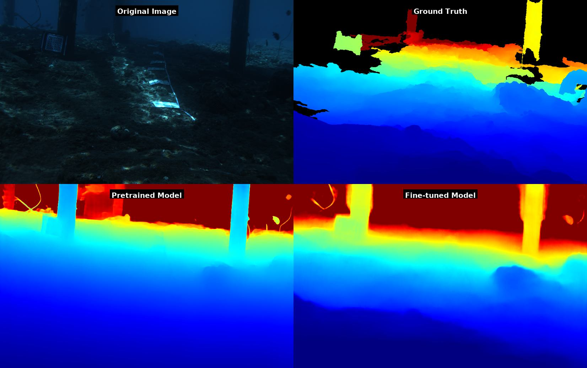
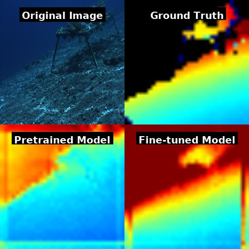
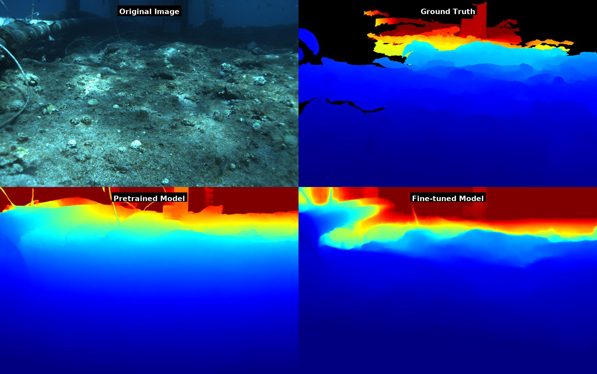
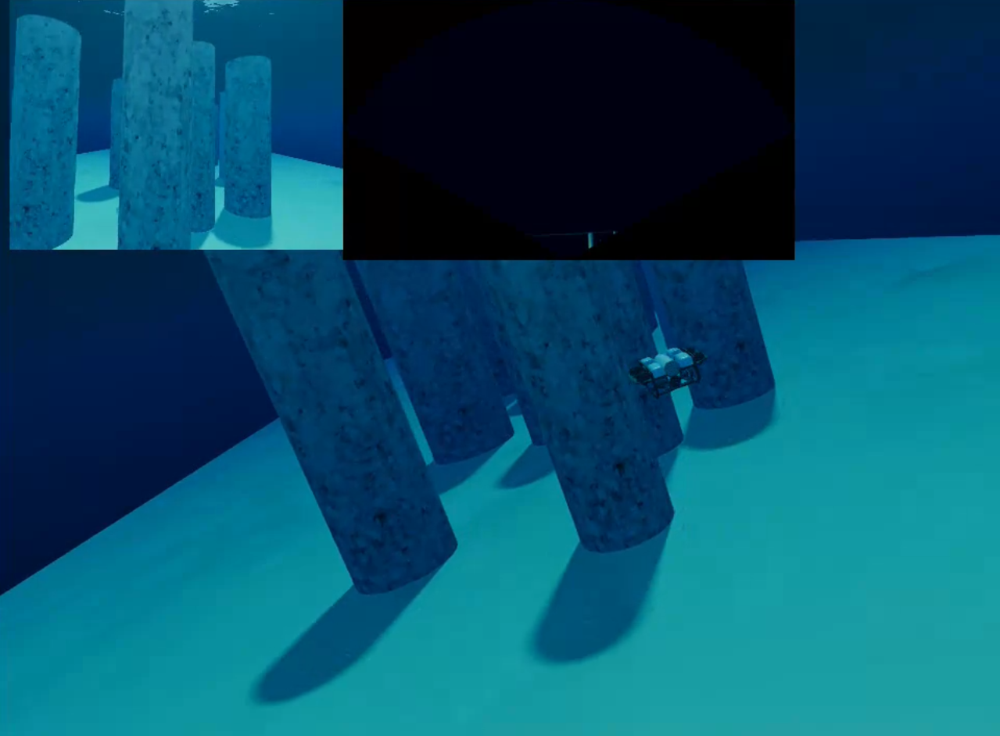
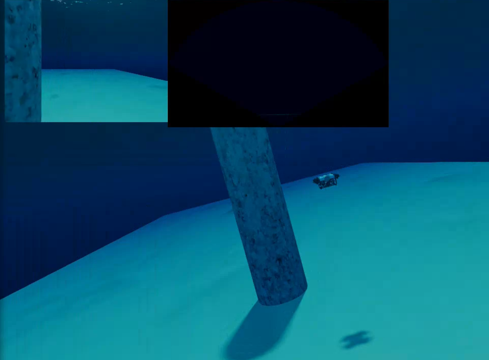
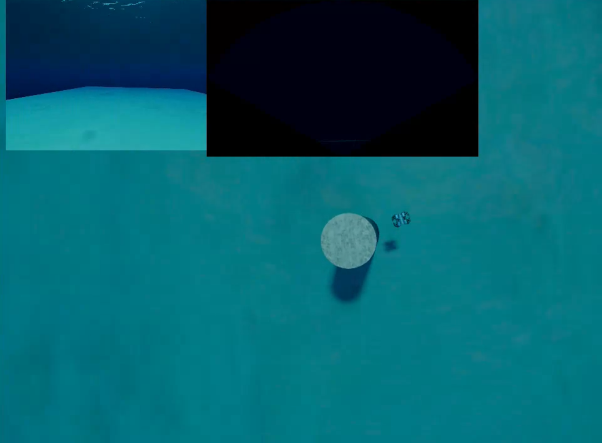
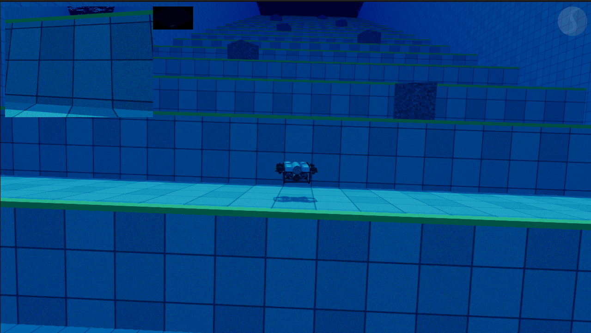

# Monocular Obstacle Detection for Underwater Experimental Platforms

**Real-time, low-cost obstacle detection and avoidance for small underwater vehicles — using a single camera and a $150 echosounder. No stereo rig, no multibeam sonar, no DVL.**

<p align="center">
  <video src="videos/opensea_rov_pipeline_60threshold.mp4" controls muted loop width="860"></video>
</p>

*Open-sea deployment on a BlueROV2. Left: detected obstacles overlaid on the camera feed. Middle: dense metric depth. Right: 3D obstacle locations and the avoidance direction.*

> Code will be posted soon, after paper acceptance.

---

## Why

Shallow reef survey needs small, cheap, deployable platforms — micro-AUVs and towed bodies. What they can't carry is the perception stack of a full-size AUV: stereo cameras, multibeam sonars, and Doppler velocity logs blow the budget and the payload.

This project shows that a **single forward camera fused with one forward-facing echosounder** is enough to detect obstacles, resolve their distance, and steer around them — in real time, on a Jetson Orin Nano, for under **$1,000** of total sensing and compute hardware.

## How it works

<p align="center">
  
</p>

1. **Detect** — a lightweight CNN runs real-time 2D obstacle detection at **117–128 FPS** on a Jetson Orin Nano.
2. **Depth** — metric **Depth Anything V2 (ViT-S)** produces a dense depth map (392×392, FP16, 220 ms/frame), running asynchronously from the detector.
3. **Ground to metric scale** — the echosounder's acoustic beam is projected into the image as a cone; its range provides a scalar correction that resolves monocular scale ambiguity (**−9.6% RMSE** on held-out FLSea locations).
4. **Avoid** — the pipeline emits high-level navigation setpoints, steering toward the direction of greatest available depth.

## The system at work

### Open-sea BlueROV2

All three pipeline stages side by side: obstacle overlay, depth estimation, and 3D obstacle localisation with avoidance direction.

<p align="center">
  <video src="videos/opensea_rov_good_snippet.mp4" controls muted loop width="860"></video>
</p>

<p align="center">
  <video src="videos/opensea_rov_with_fish.mp4" controls muted loop width="860"></video>
</p>

*Fish schools are correctly rejected as non-obstacles in the second clip.*

### Towed survey vehicle

Deployment-oriented tests on a compact towed vehicle built for Red Sea reef survey. The overlay panels show the annotated camera feed, metric depth, and the obstacle map.

<p align="center">
  <video src="videos/towed_good_run.mp4" controls muted loop width="860"></video>
</p>

<p align="center">
  <video src="videos/towed_good_until_15s.mp4" controls muted loop width="860"></video>
</p>

<p align="center">
  <video src="videos/towed_obstacle_detected_operator_late.mp4" controls muted loop width="860"></video>
</p>

*In the last clip the system correctly identifies the obstacle — the (manual-mode) operator simply reacts too late to act on the warning. The perception did its job.*

### Simulation (BlueROV2 in Stonefish)

High-fidelity simulation runs in the [Stonefish](https://github.com/patrykcieslak/stonefish) simulator, where the CNN does all the steering while the vehicle holds a constant forward velocity.

<p align="center">
  <video src="videos/sim_stairs_run_annotated.mp4" controls muted loop width="860"></video>
</p>

<p align="center">
  <video src="videos/sim_stairs_run_2.mp4" controls muted loop width="860"></video>
</p>

<p align="center">
  <video src="videos/sim_stairs_run_3.mp4" controls muted loop width="860"></video>
</p>

<p align="center">
  <video src="videos/sim_long_run_excerpt.mp4" controls muted loop width="860"></video>
</p>

## Gallery

| | |
|---|---|
|  |  |
| *BlueROV2 with forward camera and Ping1D echosounder.* | *Detecting another AUV and commanding a turn.* |
|  |  |
| *Underwater depth fine-tuning: pretrained vs fine-tuned.* | *Held-out FLSea location: fine-tuning recovers the obstacle.* |
|  |  |
| *Pool trial: free-space corridor detected through the wall grid.* | *Reef scene with the depth fine-tuned model.* |

**Simulation scenes** (Stonefish): reef field, approach, and vantage points, plus a staircase climb.

| | | |
|---|---|---|
|  |  |  |
|  | | |

## Honest limitations

Reflections and specular artefacts can trigger false positives — visible below on a bright surface reflection:

<p align="center">
  
</p>

## Code

**Code will be posted soon, after paper acceptance.** The release will include the BlueROV2/Stonefish simulation stack, the detector and depth-fusion pipeline, and the trained weights.

## Citation

```bibtex
@inproceedings{alnasser_monocular_underwater,
  title     = {Monocular Obstacle Detection for Underwater Experimental Platforms},
  author    = {Al Nasser, Ali and Abualsaud, Ali and Alshedayfat, Altayebmohd
               and Ghannoudi, Chahine and Elobaid, Mohamed and Feron, Eric},
  note      = {Robotics, Intelligent Systems and Control Laboratory (RISC),
               King Abdullah University of Science and Technology}
}
```
